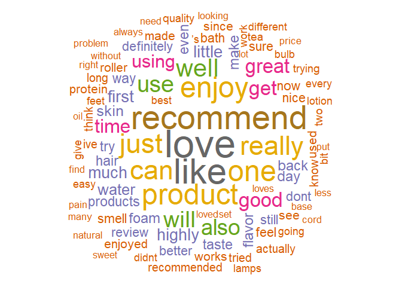
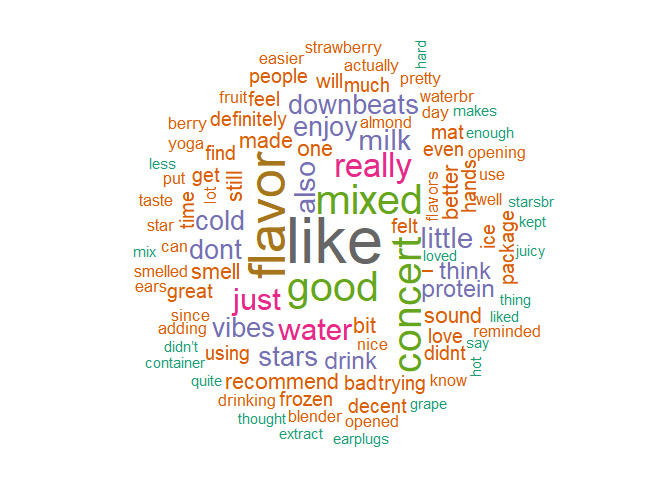

Lab7
================
Francisco Acuña - 20220565
2024-10-21

``` r
Health_and_Personal_Care <- read_csv("Health_and_Personal_Care.csv")
```

    ## Rows: 494121 Columns: 8
    ## ── Column specification ────────────────────────────────────────────────────────
    ## Delimiter: ","
    ## chr (5): title, text, product_id, parent_id, user_id
    ## dbl (2): rating, timestamp
    ## lgl (1): verified_purchase
    ## 
    ## ℹ Use `spec()` to retrieve the full column specification for this data.
    ## ℹ Specify the column types or set `show_col_types = FALSE` to quiet this message.

``` r
Health_and_Personal_Care_metadata <- read_csv("Health_and_Personal_Care_metadata.csv")
```

    ## Rows: 60293 Columns: 8
    ## ── Column specification ────────────────────────────────────────────────────────
    ## Delimiter: ","
    ## chr (5): main_category, title, store, details, parent_id
    ## dbl (3): average_rating, rating_number, price
    ## 
    ## ℹ Use `spec()` to retrieve the full column specification for this data.
    ## ℹ Specify the column types or set `show_col_types = FALSE` to quiet this message.

## 1. Cuántos productos contienen reviews con las palabras “love”, “recommend” y “enjoy”?

``` r
productos_filtrados <- Health_and_Personal_Care %>%
  filter(grepl("love", text, ignore.case = TRUE) &
           grepl("recommend", text, ignore.case = TRUE) &
           grepl("enjoy", text, ignore.case = TRUE)) %>%
  distinct(product_id, .keep_all = TRUE)

cat("Cantidad de filas con productos distintos que contienen 'love', 'recommend' y 'enjoy':", nrow(productos_filtrados), "\n")
```

    ## Cantidad de filas con productos distintos que contienen 'love', 'recommend' y 'enjoy': 110

## 2. De los reviews de la pregunta 1, encuentre el top 5 de las tiendas que los venden

``` r
productos_con_tiendas <- productos_filtrados %>%
  left_join(Health_and_Personal_Care_metadata, by = "parent_id")

top_5_tiendas <- productos_con_tiendas %>%
  group_by(store) %>%
  summarise(count = n()) %>%
  arrange(desc(count)) %>%
  head(5)

cat("Top 5 de tiendas antes de la limpieza: \n")
```

    ## Top 5 de tiendas antes de la limpieza:

``` r
print(top_5_tiendas)
```

    ## # A tibble: 5 × 2
    ##   store     count
    ##   <chr>     <int>
    ## 1 <NA>          7
    ## 2 ASUTRA        3
    ## 3 DownBeats     2
    ## 4 JUNP          2
    ## 5 Syntrax       2

``` r
productos_con_tiendas_limpio <- productos_con_tiendas %>%
  mutate(store = str_trim(store)) %>%
  filter(store != "",
         store != "n/a",
         nchar(store) > 0) %>%
  mutate(store = tolower(store))

top_5_tiendas_limpio <- productos_con_tiendas_limpio %>%
  group_by(store) %>%
  summarise(count = n()) %>%
  arrange(desc(count)) %>%
  head(5)

cat("Top 5 de tiendas después de la limpieza: \n")
```

    ## Top 5 de tiendas después de la limpieza:

``` r
print(top_5_tiendas_limpio)
```

    ## # A tibble: 5 × 2
    ##   store        count
    ##   <chr>        <int>
    ## 1 asutra           3
    ## 2 downbeats        2
    ## 3 junp             2
    ## 4 syntrax          2
    ## 5 alter native     1

## 3. Generar un wordcloud sin stopwords de los reviews de la pregunta 1

``` r
reviews_text <- productos_filtrados$text

corpus <- Corpus(VectorSource(reviews_text))

corpus <- corpus %>%
  tm_map(content_transformer(tolower)) %>%
  tm_map(removePunctuation) %>%
  tm_map(removeNumbers) %>%
  tm_map(removeWords, stopwords("en"))
```

    ## Warning in tm_map.SimpleCorpus(., content_transformer(tolower)): transformation
    ## drops documents

    ## Warning in tm_map.SimpleCorpus(., removePunctuation): transformation drops
    ## documents

    ## Warning in tm_map.SimpleCorpus(., removeNumbers): transformation drops
    ## documents

    ## Warning in tm_map.SimpleCorpus(., removeWords, stopwords("en")): transformation
    ## drops documents

``` r
dtm <- TermDocumentMatrix(corpus)
matrix <- as.matrix(dtm)

word_freqs <- sort(rowSums(matrix), decreasing = TRUE)


df_words <- data.frame(word = names(word_freqs), freq = word_freqs)

set.seed(1234)  # Para reproducibilidad
wordcloud(words = df_words$word, freq = df_words$freq, min.freq = 2,
          max.words = 100, random.order = FALSE, colors = brewer.pal(8, "Dark2"))
```

<!-- -->

## 4. Generar un wordcloud de los reviews de las 5 tiendas encontradas en la pregunta 2

``` r
top_5_tiendas_limpio_names <- top_5_tiendas_limpio$store

reviews_top_5_tiendas <- productos_con_tiendas_limpio %>%
  filter(store %in% top_5_tiendas_limpio_names)

reviews_text_top_5 <- reviews_top_5_tiendas$text

corpus_top_5 <- Corpus(VectorSource(reviews_text_top_5))

corpus_top_5 <- corpus_top_5 %>%
  tm_map(content_transformer(tolower)) %>%
  tm_map(removePunctuation) %>%
  tm_map(removeNumbers) %>%
  tm_map(removeWords, stopwords("en"))
```

    ## Warning in tm_map.SimpleCorpus(., content_transformer(tolower)): transformation
    ## drops documents

    ## Warning in tm_map.SimpleCorpus(., removePunctuation): transformation drops
    ## documents

    ## Warning in tm_map.SimpleCorpus(., removeNumbers): transformation drops
    ## documents

    ## Warning in tm_map.SimpleCorpus(., removeWords, stopwords("en")): transformation
    ## drops documents

``` r
dtm_top_5 <- TermDocumentMatrix(corpus_top_5)
matrix_top_5 <- as.matrix(dtm_top_5)

word_freqs_top_5 <- sort(rowSums(matrix_top_5), decreasing = TRUE)

df_words_top_5 <- data.frame(word = names(word_freqs_top_5), freq = word_freqs_top_5)

set.seed(1234)
wordcloud(words = df_words_top_5$word, freq = df_words_top_5$freq, min.freq = 2,
          max.words = 100, random.order = FALSE, colors = brewer.pal(8, "Dark2"))
```

<!-- -->

## 5. Cuáles son las 25 palabras más frecuentes de los reviews?

``` r
reviews_text <- productos_filtrados$text

corpus <- Corpus(VectorSource(reviews_text))

corpus <- corpus %>%
  tm_map(content_transformer(tolower)) %>%
  tm_map(removePunctuation) %>%
  tm_map(removeNumbers) %>%
  tm_map(removeWords, stopwords("en"))
```

    ## Warning in tm_map.SimpleCorpus(., content_transformer(tolower)): transformation
    ## drops documents

    ## Warning in tm_map.SimpleCorpus(., removePunctuation): transformation drops
    ## documents

    ## Warning in tm_map.SimpleCorpus(., removeNumbers): transformation drops
    ## documents

    ## Warning in tm_map.SimpleCorpus(., removeWords, stopwords("en")): transformation
    ## drops documents

``` r
dtm <- TermDocumentMatrix(corpus)
matrix <- as.matrix(dtm)

word_freqs <- sort(rowSums(matrix), decreasing = TRUE)

df_words <- data.frame(word = names(word_freqs), freq = word_freqs)

top_25_words <- head(df_words, 25)

print(top_25_words)
```

    ##                word freq
    ## love           love  107
    ## like           like   97
    ## recommend recommend   90
    ## enjoy         enjoy   77
    ## product     product   77
    ## one             one   76
    ## just           just   72
    ## really       really   71
    ## can             can   70
    ## well           well   64
    ## use             use   62
    ## will           will   58
    ## also           also   56
    ## good           good   51
    ## get             get   51
    ## great         great   50
    ## time           time   45
    ## using         using   44
    ## little       little   39
    ## first         first   38
    ## highly       highly   36
    ## much           much   36
    ## water         water   35
    ## skin           skin   32
    ## flavor       flavor   31
