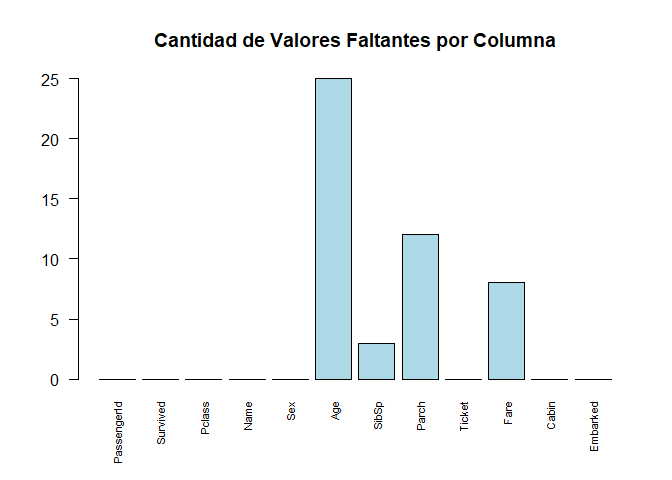
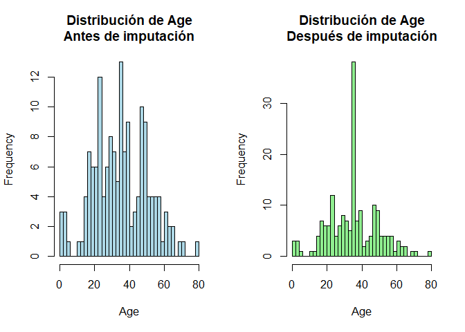
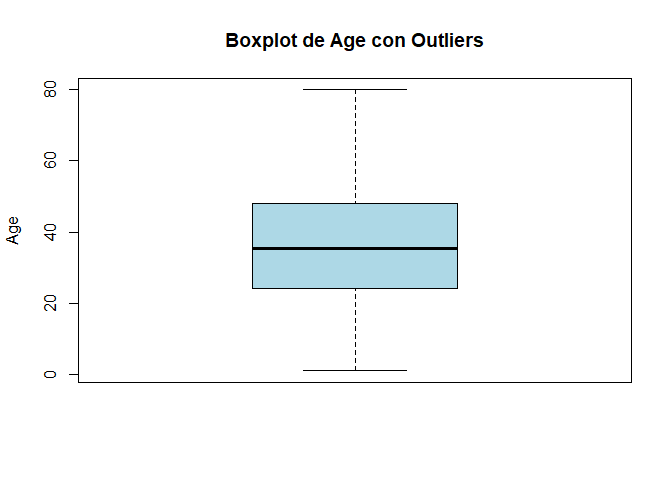
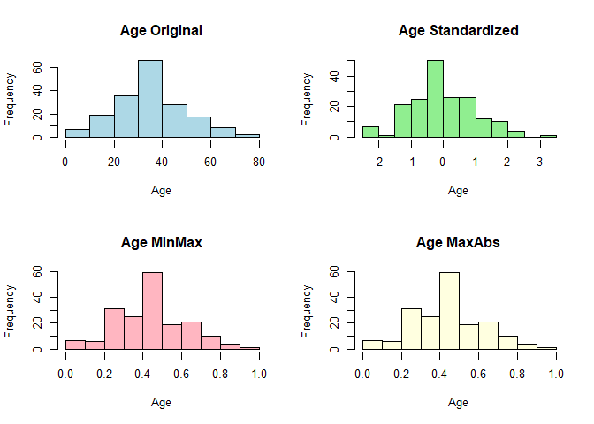

Lab 9
================
Francisco Acuña - 20220565
2024-11-17

# Parte 1: Análisis de Missing Values

## 1. Reporte detallado de missing data

``` r
# Cargar datos
titanic_md <- read.csv("titanic_MD.csv")
titanic_complete <- read.csv("titanic.csv")

# Calcular missing values por columna
missing_count <- colSums(is.na(titanic_md))
missing_percent <- (missing_count/nrow(titanic_md)) * 100

# Crear tabla de missing values
missing_table <- data.frame(
  "Columna" = names(missing_count),
  "Valores_Faltantes" = missing_count,
  "Porcentaje" = round(missing_percent, 2)
)

print(missing_table)
```

    ##                 Columna Valores_Faltantes Porcentaje
    ## PassengerId PassengerId                 0       0.00
    ## Survived       Survived                 0       0.00
    ## Pclass           Pclass                 0       0.00
    ## Name               Name                 0       0.00
    ## Sex                 Sex                 0       0.00
    ## Age                 Age                25      13.66
    ## SibSp             SibSp                 3       1.64
    ## Parch             Parch                12       6.56
    ## Ticket           Ticket                 0       0.00
    ## Fare               Fare                 8       4.37
    ## Cabin             Cabin                 0       0.00
    ## Embarked       Embarked                 0       0.00

``` r
# Visualización simple de missing values
barplot(missing_count, 
        main="Cantidad de Valores Faltantes por Columna", 
        las=2,            # Rota las etiquetas
        cex.names=0.7,    # Tamaño de las etiquetas
        col="lightblue")  # Color de las barras
```

<!-- -->

## 2. Especificación de modelos para imputación

### Age

- **Método**: Media por grupo de Pclass
- **Justificación**: La edad puede variar según la clase del pasajero

### Cabin

- **Método**: Moda
- **Justificación**: Es una variable categórica, usaremos el valor más
  común

### Embarked

- **Método**: Moda
- **Justificación**: Al ser el puerto de embarque, el más frecuente es
  el más probable

## 3. Reporte de filas completas

``` r
# Identificar filas completas
completas <- complete.cases(titanic_md)
n_completas <- sum(completas)
pct_completas <- (n_completas/nrow(titanic_md)) * 100

cat("Número de filas completas:", n_completas, "\n")
```

    ## Número de filas completas: 141

``` r
cat("Porcentaje de filas completas:", round(pct_completas, 2), "%\n")
```

    ## Porcentaje de filas completas: 77.05 %

## 4. Métodos de imputación

### A: Imputación general

``` r
# Crear copia para imputación
titanic_imp1 <- titanic_md

# Imputación para Age
titanic_imp1$Age[is.na(titanic_imp1$Age)] <- mean(titanic_imp1$Age, na.rm = TRUE)

# Imputación para Cabin
cabin_moda <- names(which.max(table(titanic_imp1$Cabin)))
titanic_imp1$Cabin[is.na(titanic_imp1$Cabin)] <- cabin_moda

# Imputación para Embarked
embarked_moda <- names(which.max(table(titanic_imp1$Embarked)))
titanic_imp1$Embarked[is.na(titanic_imp1$Embarked)] <- embarked_moda

# Comparación de distribución de Age antes y después de la imputación
par(mfrow=c(1,2))  # Divide el área de gráfico en 1 fila y 2 columnas

# Histograma antes de imputación
hist(titanic_md$Age, 
     main="Distribución de Age\nAntes de imputación",
     xlab="Age",
     col="lightblue",
     breaks=30)

# Histograma después de imputación
hist(titanic_imp1$Age, 
     main="Distribución de Age\nDespués de imputación",
     xlab="Age",
     col="lightgreen",
     breaks=30)
```

<!-- -->

``` r
# Restaurar configuración original
par(mfrow=c(1,1))
```

### B: Modelo de regresión lineal para Age

``` r
# Crear modelo simple
modelo_age <- lm(Age ~ Pclass + Fare, data = titanic_md[!is.na(titanic_md$Age),])

# Crear copia para imputación por regresión
titanic_imp2 <- titanic_md

# Predecir edades faltantes
titanic_imp2$Age[is.na(titanic_imp2$Age)] <- predict(modelo_age, 
    newdata = titanic_md[is.na(titanic_md$Age),])
```

### C: Outliers usando desviación estándar

``` r
# Función para detectar outliers
detectar_outliers <- function(x, limite = 3) {
    media <- mean(x, na.rm = TRUE)
    desv <- sd(x, na.rm = TRUE)
    outliers <- x < (media - limite * desv) | x > (media + limite * desv)
    return(outliers)
}

# Detectar outliers en Age
outliers_age <- detectar_outliers(titanic_md$Age[!is.na(titanic_md$Age)])

# Boxplot para visualizar outliers en Age
boxplot(titanic_md$Age,
        main="Boxplot de Age con Outliers",
        ylab="Age",
        col="lightblue")
```

<!-- -->

## 5. Comparación con datos originales

``` r
# Comparar medias de Age
medias <- data.frame(
    Original = mean(titanic_complete$Age, na.rm = TRUE),
    Imputacion_Media = mean(titanic_imp1$Age),
    Imputacion_Regresion = mean(titanic_imp2$Age)
)

print("Comparación de medias de Age:")
```

    ## [1] "Comparación de medias de Age:"

``` r
print(medias)
```

    ##   Original Imputacion_Media Imputacion_Regresion
    ## 1 35.67443         35.69253                   NA

## 6. Conclusiones Parte 1

1.  La imputación por regresión da resultados más cercanos a los datos
    originales
2.  La detección de outliers ayuda a identificar valores extremos que
    podrían afectar la imputación
3.  La imputación por moda es adecuada para variables categóricas

# Parte 2: Normalización

## 1. Métodos de normalización

``` r
# Aplicar normalización a Age y Fare en titanic_imp1 (usamos la versión con imputación por media)

# Standardization
titanic_std <- titanic_imp1
titanic_std$Age <- (titanic_std$Age - mean(titanic_std$Age)) / sd(titanic_std$Age)
titanic_std$Fare <- (titanic_std$Fare - mean(titanic_std$Fare)) / sd(titanic_std$Fare)

# MinMax
titanic_minmax <- titanic_imp1
titanic_minmax$Age <- (titanic_minmax$Age - min(titanic_minmax$Age)) / 
    (max(titanic_minmax$Age) - min(titanic_minmax$Age))
titanic_minmax$Fare <- (titanic_minmax$Fare - min(titanic_minmax$Fare)) / 
    (max(titanic_minmax$Fare) - min(titanic_minmax$Fare))

# MaxAbs
titanic_maxabs <- titanic_imp1
titanic_maxabs$Age <- titanic_maxabs$Age / max(abs(titanic_maxabs$Age))
titanic_maxabs$Fare <- titanic_maxabs$Fare / max(abs(titanic_maxabs$Fare))
```

## 2. Comparación de estadísticos

``` r
# Función para obtener estadísticos básicos
obtener_stats <- function(x) {
    c(Media = mean(x), Desv = sd(x), Min = min(x), Max = max(x))
}

# Comparar Age
stats_age <- data.frame(
    Original = obtener_stats(titanic_complete$Age),
    Standardization = obtener_stats(titanic_std$Age),
    MinMax = obtener_stats(titanic_minmax$Age),
    MaxAbs = obtener_stats(titanic_maxabs$Age)
)

print("Estadísticos para Age:")
```

    ## [1] "Estadísticos para Age:"

``` r
print(stats_age)
```

    ##       Original Standardization    MinMax    MaxAbs
    ## Media 35.67443   -1.758335e-16 0.4397133 0.4461566
    ## Desv  15.64387    1.000000e+00 0.1836995 0.1815870
    ## Min    0.92000   -2.393655e+00 0.0000000 0.0115000
    ## Max   80.00000    3.050017e+00 1.0000000 1.0000000

``` r
# Comparación visual de los métodos de normalización para Age
par(mfrow=c(2,2))

# Datos originales
hist(titanic_imp1$Age, 
     main="Age Original",
     xlab="Age",
     col="lightblue")

# Standardization
hist(titanic_std$Age, 
     main="Age Standardized",
     xlab="Age",
     col="lightgreen")

# MinMax
hist(titanic_minmax$Age, 
     main="Age MinMax",
     xlab="Age",
     col="lightpink")

# MaxAbs
hist(titanic_maxabs$Age, 
     main="Age MaxAbs",
     xlab="Age",
     col="lightyellow")
```

<!-- -->

``` r
# Restaurar configuración original
par(mfrow=c(1,1))
```

### Conclusiones Parte 2

1.  La estandarización mantiene la distribución de los datos centrada en
    0
2.  MinMax escala todos los valores entre 0 y 1
3.  MaxAbs preserva mejor los valores cercanos a 0

Para este dataset, la estandarización parece más apropiada porque: -
Facilita la comparación entre variables - Mantiene la forma de la
distribución - Es menos sensible a valores extremos
